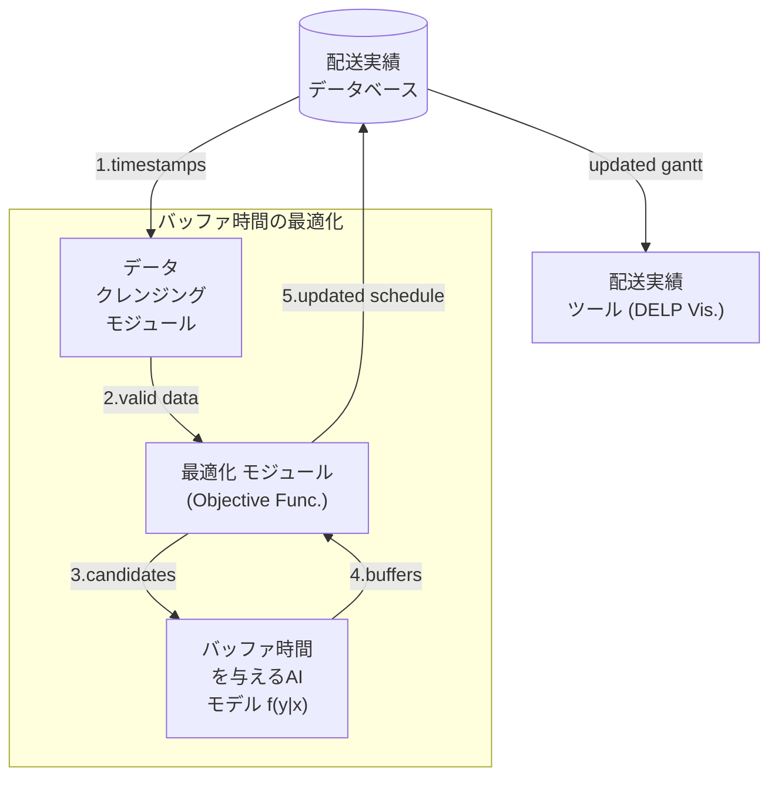

# Баффер хугацаа сайжруулалт (バッファ時間最適化) 📅🎯🛠️

| Who 👨‍🔧 | When ⏲️    | Description 📚                                                                                |
| --------- | ---------- | --------------------------------------------------------------------------------------------- |
| E.B       | 2024/10/16 | Докумэнтийн анхны хувилбарыг үүсгэв. Төслийн тодорхойлолтын анхны ноорог гаргав.              |
| E.B       | 2024/10/16 | Түүлийн баримтлах нөхцөл ба хязгаарлалтыг өгөгдөл ба боловсруулалтын хувьд нэмэлтээр оруулав. |

## 1. Тодорхойлолт (定義)

Баффер хугацааны сайжруулалт бол төлөвлөгөөний дагуу хийгдэх ажлууд (i.e. jobs) доторх тодорхой дарааллаар гүйцэтгэтгэх процессийн (i.e. tasks) төлөвлөсөн эхлэх цаг ба үргэлжлэх хугацааг (i.e. scheduled starting time and duration) жинхэнэ гүйцэтгэлийн утгуудад нь  дөхүүлэх зорилгоор баффер хугацааг оновчтойгоор оноож өгөх оролдлого юм. Буффер хугацаа оноолт нь үндсэндээ хоёр янзаар явагдана:

1. Эхлэлийн цаг тааруулах: $b_p \in \mathbb{R}$ бафферийг процесс $P$-н төлөвлөсөн эхлэх цаг $t_p$ дээр нэмж оруулснаар $P$ нь $t_p+b_p$ хугацаанд эхлэхээр төлөвлөгдөх юм. 

2. Үргэлжлэх хугацааг тааруулах: $b_p^\prime \in \mathbb{R}$ баффер хугацааг процесс $P$-н үргэлжлэх хугацаа $d_p$ дээр нэмснээр дуусах цагийг $t_p+(d_p+b_p^\prime)$ илүү дөхөм төлөвлөх.

Энд $b_p$ ба $b_p^\prime$ бодит тоо учраас эхлэх цагийг хойшлуулахаас гадна урагшуулах, мөн үргэлжлэх хугацааг уртасгаж эсвэл богиносгож чадна. 

## 2. Хязгаарлалт ба нөхцөл (制約と条件)

Дээрх баффер хугацааны өөрчлөлт хийгдэхэд боловсруулах өгөгдөл ба боловсруулах хувиргалтын функцтэй холбоотойгоор хэд хэдэн нөхцлүүд баримтлагдана.

### 2.1 Өгөгдөл (データ)

Өгөгдлийн бүрэн бүтэн байдал (i.e. data integrity) нь дараах [нөхцлүүдийг](https://developers.google.com/optimization/scheduling/job_shop) хангах шаардлагатай:

* Нийт үйлдвэр дээр хийгдэх ажлуудын нэгж нь Job/Ажил байна. Ажлууд доторх процессууд нь нэгэн зэрэг адилхан машин дээр хийгдэхээр хуваарилагдаагүй цагт параллелаар гүйцэтгэгдэж болно.

* Ажил $J$ нь $n\in\mathbb{N}$ тооны процессуудаас $\{P_1, P_2, ..., P_n\}$ бүрдэх ба $P_i$ нь эхлэх цаг $t_{P_i}$, үргэлжлэх хугацаа $d_{P_i}$, хийгдэх дараалал $i$ ба боловсруулагдах машинаараа $m_{P_i}$ тодорхойлогдоно.

* $P_{i+1}$ нь $P_i$ дууссан цагт л эхлэх ёстой. Өөрөөр илэрхийлбэл: $t_{P_{i}} + d_{P_i} \leq t_{P_{i+1}}$ байна.

### 2.2 Боловсруулалт (変換)

* Төлөвлөгөөнд баффер өөрчлөлт нэмэгдвэл $t_{P_{i}} + d_{P_i} + b_{P_i}^\prime \leq t_{P_{i+1}} + b_{P_{i+1}}$ болж хувирна. $P_i$ дээр үргэлжлэх хугацааны баффер нэмэгдэж $P_{i+1}$ дээр эхлэх цагийн баффер нэмэгдэнэ гэсэн үг.

* Хэдэн ажлын хуваарилалт хийх нь төлөвлөсөн хугацаагаар  $T$ тодорхойлогдоно. Хэрвээ $T$ дотор $m$ ажил байгаад $J_m$ нь хамгийн сүүлийн ажил болоод $n$ ширхэг процессоос бүрдэж байгаа бол $t_{P_n}+d_{P_n}+b_{P_n} \leq T$ байх ёстой.

* Ажил $i$-ийн процесс $j$-г $P_{ij}$ гэж үзье. Нэмээд, $t_{P_{ij}}$-ийн өмнө $b_{P_{ij}}$ баффер оруулсан гэж үзье. Тэгвэл, $i$ дугаар ажлын $j$-ээс хойш бүх процесс ижил хугацаагаар хойшлоно. Үүнээс гадна, $P_{ij}$-ээс хойших бүх процессийн хувьд, ижилхэн машин дээр хуваарилагдсанаас үүдээд боловсруулагдаж дуусахыг нь хүлээхээр товлогдсон өөр бусад ажлын бүх процессууд гинжин хамаарлаар хойш түлхэгдэнэ. Иймд эхлэх цагийн баффер $b_{P{ij}}$ оруулах бүртээ нийт төлөвлөгөөний урт хэрхэн хойшилсныг мэдэх шаардлагатай.

* Оноолт хийж болох нийт бафферийг бафферийн нөөц $B$ гэнэ. Бафферийн нөөц $k$ машин (i.e. main resource) байхад $\{B_1, ..., B_k\}$ багцаар илэрхийлэгдэнэ. $k$-р машины сүүлийн ажил $T$-ээс хэр өмнө дуусч байгаагаар баффер нөөц $B_k$ тодорхойлогдоно. 

* Өмнөх дурьдсан асуудлаас үүдээд, $B_i$-аас төлөвлөгөө рүү баффер хуваарилалт хийхэд $B_j$ (энд $i \neq j$) нөөцөд нөлөөлж болно. Иймд баффер эхлэх цагуудын өмнө оноох тутамдаа бусад бафферийн нөөцөө дахин тооцоолох шаардлагатай.

## 3. Бүтэц (構造)

DELP системээс гарах захиалгын хуваарь (i.e. timestamps):

- **Cleaning Module:** дээр өгөгдлийн бүрэн бүтэн байдлын (i.e. data integrity) шалгалтаар дамжиж (жишээ нь хоосон эхлэх цаггүй байх, дуусах цаг эхлэх цагаасаа өмнө биш байх, нэг ажлын дараалсан 2 процесс хойдох нь удаахиас өмнө эхэлсэн байж болохгүй г.м.)
  
  - *Оролт*: timestamps буюу төлөвлөсөн ажлуудын эхлэх дуусах цагийн үйлдвэр дээр хүргэгдэж ирэх цагийн хуваарь.
  
  - *Гаралт*: validated data буюу timestamps өгөгдөл дээр өгөгдлийн бүрэн байдлын шалгалтаар шүүлт хийгээд стохастик функцийн шаардах өгөгдлийн бүтцэд оруулсан хуваарь.

- 
